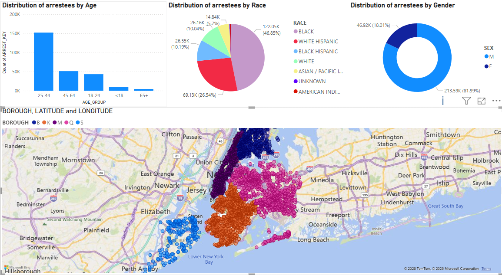
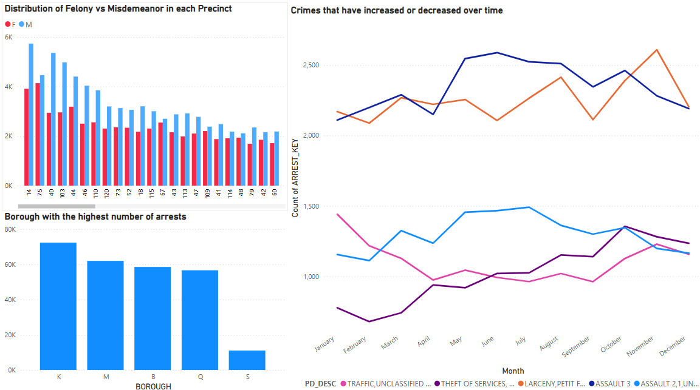
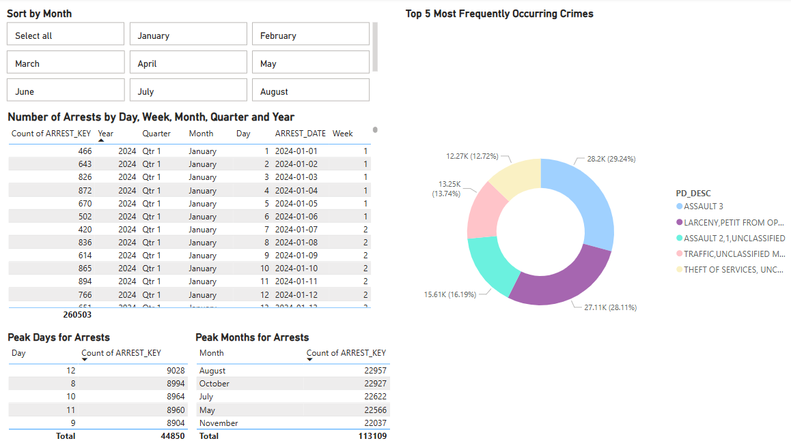
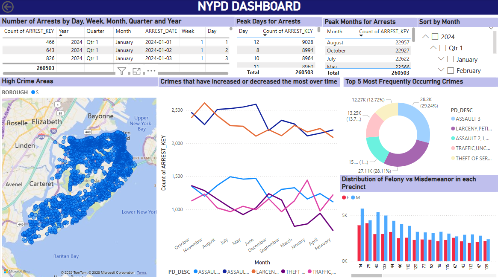

# 🕵️ NYPD Crime Data Warehouse & Analytics Dashboard

## 📌 Project Overview

This project presents an end-to-end data analytics solution using the **NYPD Arrests (Year-to-Date)** dataset. From scalable data modeling and ETL pipeline engineering to interactive dashboards, the goal was to turn raw arrest records into actionable insights for public safety and law enforcement planning.

---

## 🧱 Architecture & Data Modeling

- Designed a scalable **dimensional model** with clearly defined grain levels for effective crime trend analysis.
- Built a **Snowflake schema** incorporating key dimensions: Arrests, Crimes, Criminals, Location, Date.
- Used **ER/Studio** for modeling logical and physical schemas optimized for complex analytical queries.

---

## 🔄 ETL Pipeline Engineering

- Ingested and processed **260K+ records** using a robust ETL pipeline in **Azure Data Factory**.
- Data Engineering Highlights:
  - Extracted data from **NYC Open Data** portal.
  - Applied transformations to fix nulls, standardize formats, and remove duplicates.
  - Loaded cleansed data into **Snowflake staging tables**.
  - Achieved a **40% improvement in data quality** and **30% gain in pipeline efficiency**.

---

## 📊 Business Intelligence & Visualization

Developed interactive dashboards in **Power BI** to uncover trends and enable informed decision-making.

### ✅ Key Features:
- 👥 **Demographic Analysis** (Age, Race, Gender)
- 🕒 **Time Series Trends** by Day, Month, Quarter, Year
- 📍 **Geo-spatial Visuals** of Arrests by Borough and Precinct
- ⚖️ **Felony vs Misdemeanor Breakdown**
- 🔁 **Recurring Crime Patterns**
- 📈 **Trend Analysis for Crime Increase/Decrease**

---

## 🖼️ Dashboard Previews

### 📌 Arrest Distribution by Age, Race, Gender & Borough

---

### 🔍 Felony vs Misdemeanor by Precinct & Monthly Crime Trends

---

### 📅 Arrest Analysis by Day, Month, Quarter & High-Crime Heatmap

---

### 📅 Dashboard

> 📸 *Replace `images/dashboardX.png` with the actual path where you store your images in the repo.*

---

## 💼 Business Value Delivered

- 🚓 Identified **peak crime periods** to optimize police staffing
- 📉 Tracked evolving crime patterns for **preventive action**
- 🧑‍🤝‍🧑 Supported **community outreach** using demographic insights
- 🔮 Enabled **predictive policing** through historical trend analysis
- 🧭 Provided crime awareness tools for NYC residents and visitors

---

## 🧰 Tech Stack & Skills

| Category               | Tools/Skills                                    |
|------------------------|-------------------------------------------------|
| **Data Warehousing**   | Snowflake, SQL                                  |
| **ETL Development**    | Azure Data Factory, Alteryx                     |
| **Data Modeling**      | ER/Studio, Snowflake Schema                     |
| **BI & Visualization** | Power BI                                        |
| **Data Engineering**   | Data profiling, transformation, cleansing       |
| **Version Control**    | Git & GitHub                                    |

---

## 📂 Data Source

[NYPD Arrest Data (Year-to-Date) – NYC Open Data](https://data.cityofnewyork.us/Public-Safety/NYPD-Arrest-Data-Year-to-Date-/uip8-fykc)

---

## ✅ Key Highlights

- 🧹 Improved data quality by **40%**
- ⚙️ Increased ETL efficiency by **30%**
- 📊 Visualized **260,000+ records**
- 📍 Mapped high-risk zones across **all NYC boroughs**
- 📅 Delivered multi-grain analytics by time, location, and offense type

---
